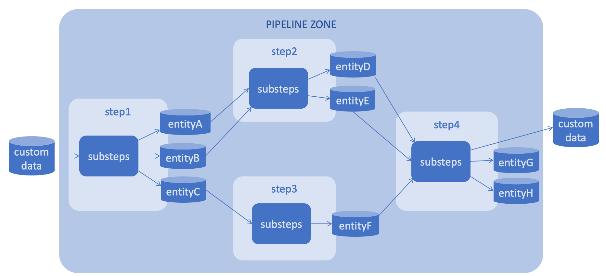

# How it works

Prerequisites

- Docker is up and running
- Git installed

# Deploy an environment for a single use

```
git clone --recursive https://github.com/4-DS/step_template.git
cd step_template
```

## To make use of it, run:
```
bash create.sh
bash run.sh
```

### Go on http://127.0.0.1:8888/lab
```
git clone --recursive https://github.com/4-DS/step_template.git
cd step_template
```

### Run 'Init_Data.ipynb' to get sample data

### Run 'step.dev.py' in Terminal 

```python step.dev.py```

## To stop using it for a while, run:
```
bash stop.sh
```

## To continue using it, run:
```
bash run.sh
```

## To remove it, run:
```
bash remove.sh
```

# Let's create a simple ML pipeline




See the ready steps step1-4 of pipeline with the name 'pipeline0' at 
    https://github.com/4-DS/pipeline0-step1.git
    https://github.com/4-DS/pipeline0-step2.git
    https://github.com/4-DS/pipeline0-step3.git
    https://github.com/4-DS/pipeline0-step4.git